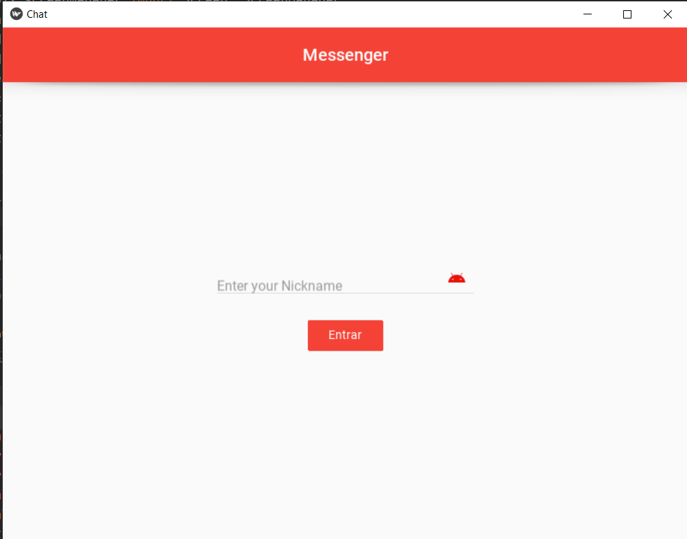

# Chat Cliente-Servidor

<!---Esses são exemplos. Veja https://shields.io para outras pessoas ou para personalizar este conjunto de escudos. Você pode querer incluir dependências, status do projeto e informações de licença aqui--->




Chat de comunicação cliente-servidor desenvolvido para a disciplina de sistema distribuídos. foi desenvolvido um chat, com os protocolos tcp e udp, utilizando dois arquivos .py. client.py,server.py. Usando a comunicação com base no protócolo TCP E UDP.

Posteriormente, foi desenvolvido novamente um chat, com a biblioteca gRPC do Python, utilizando a comunicação RPC(REMOTE PROCEDURE CALL), e a Biblioteca Kivy/KivyMD para fazer a interface gráfica.


## 💻 Pré-requisitos

Antes de começar, verifique se você atendeu aos seguintes requisitos:
<!---Estes são apenas requisitos de exemplo. Adicionar, duplicar ou remover conforme necessário--->
* Você instalou o Python em sua máquina(versão 3.6 ou superior)`
* Você tem uma máquina `<Windows / Linux / Mac>`.
* Instalar as dependências do projeto( bibliotecas kivy/kivymd/grpc/threading) 

## 🚀 Instalando o chat

Para instalar o projeoto, clone o repositório:


```
https://github.com/xelel/Sistemas-Distribuidos.git
```


## ☕ Usando o chat

Para usar o Chat, siga estas etapas:

Execute o arquivo client.py de acordo com o número de clientes(pessoas) comunicando-se via char gRPC

Exemplo do funcionamento da interface:


